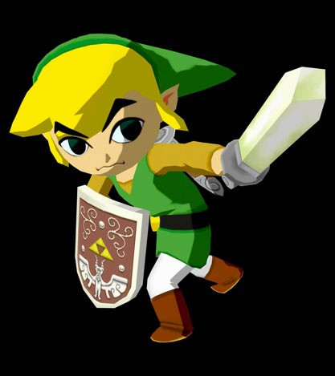
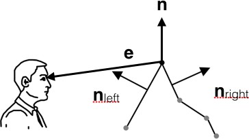
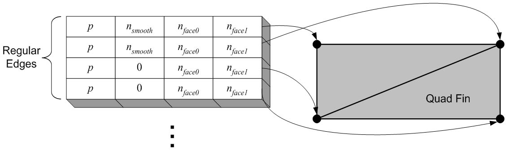
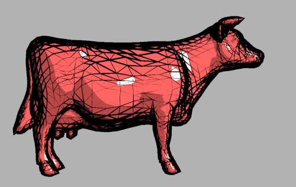
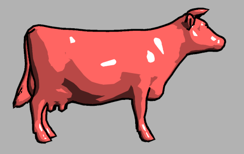
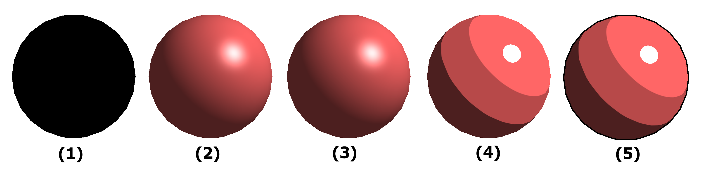
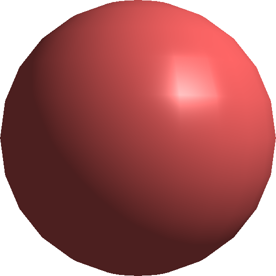

# Assignment 5: Artistic Rendering

Usage: 
1. after git cloning this repo, run "npm install" in your terminal<br/>
2. then run the program with "npm run start" <br/>
3. alternatively, you can use this link if you prefer not to clone:<br/>
https://csci-4611-spring-2022.github.io/assignment-5-vangben/<br/>

Original repo: https://github.com/CSCI-4611-Spring-2022/assignment-5-vangben <br/>

GLSL shaders make it possible for us to create some amazing lighting effects in real- time computer graphics. These range from photorealistic lighting to artistically inspired non-photorealistic rendering, as featured in games like *The Legend of Zelda: The Wind Waker* and *Team Fortress 2*. In this assignment, you will implement GLSL shaders that can produce both realistic per-pixel lighting, cartoon shading, and a variety of other effects. You will also implement another shader that adds silhouette edges to complete a cartoon effect.

In this assignment, you will learn:

- How to calculate realistic and artistic per-pixel lighting in real-time.
- How to modify geometry on the fly to create viewpoint-dependent effects such as silhouette edges.
- How to implement and use your own shader programs!

You can try out the [instructor's implementation](https://csci-4611-spring-2022.github.io/Builds/Assignment-5) in the Builds repository on the course GitHub.

## Submission Information

You should fill out this information before submitting your assignment. Make sure to document the name and source of any third party assets that you added, such as models, images, sounds, or any other content used that was not solely written by you. 

Name: Benjamin Vang - vang2756

Third Party Assets:

Wizard Bonus Functionality:

## Prerequisites

To work with this code, you will first need to install [Node.js](https://nodejs.org/en/) and [Visual Studio Code](https://code.visualstudio.com/). 

## Getting Started

The starter code implements the general structure that we reviewed in lecture.  After cloning your repository, you will need to set up the initial project by pulling the dependencies from the node package manager with:

```
npm install
```

This will create a `node_modules` folder in your directory and download all the dependencies needed to run the project.  Note that this folder is `.gitignore` file and should not be committed to your repository.  After that, you can compile and run a server with:

```
npm run start
```

The build system should launch your program in a web browser automatically.  If not, you can run it by pointing your browser at `http://localhost:8080`.

## Requirements

We provide code for loading several 3D model files, rotating them on the screen using the mouse, and toggling between Gouraud shading, Phong shading, "toon" shading, and wireframe shading. For this assignment, you **only** need to modify the GLSL code in the .vert and .frag shader programs.  However, you are welcome to add to the TypeScript code if you want to add additional wizard functionality.

There are three shader mini-programs that you need to complete:

1. Complete the `phong.frag` fragment shader to correctly calculate per-pixel shading using the standard Phong (or Blinn-Phong) lighting model. 
2. Complete the `toon.frag` fragment shader to correctly calculate the per-pixel toon shading, using the *diffuseRamp.png* and *specularRamp.png* textures to control the lighting.
3. Complete the `outline.vert` vertex shader to draw a black outline for the silhouette edges of the mesh, when rendering in "toon" mode.

## GopherGfx

The base program for this assignment is implemented using GopherGfx, a high-level graphics library currently under development by your instructor.  The goals include: (1) implementing all of the functionality for teaching CSCI 4611 in future semesters, (2) maintaining a minimalistic, clean, and consistent structure, and (3) avoiding the unnecessary complexities and pain points that have tripped people up while trying to learn TypeScript and Three.js. GopherGfx has an extensible framework for shader programming and includes Gouraud, wireframe, and unlit shaders out-of-the-box.

The basic skeleton for the Phong, cartoon, and outline shaders is already provided, and all the necessary information has already been passed to each program.  Therefore, you will not need to modify the TypeScript code or familiarize yourself with the GopherGfx API in order to complete this assignment.  However, please feel free to poke around the code if you would like to learn more about how a high-level graphics library is organized.

## Per-Pixel Phong Shading

In class, we will work on some shader programs that calculate ambient, diffuse, and specular lighting using per-vertex (Gouraud) shading.  You can also find the complete vertex and fragment shader code in `GopherGfx/shaders/gouraud.vert` and `GopherGfx/shaders/gouraud.frag`, respectively.  

Your job is to implement per-pixel Phong shading with the same lighting model as the Gouraud shader. You should be able to build this by adapting code from the shaders that we discuss and develop in class.  You will need to write a fragment shader that performs all the calculations to accurately calculate the Phong lighting model for each pixel.  The lighting terms must vary per-pixel based on the normal and the light position, as well as the various material properties (such as the specular exponent). You should implement this shader following the lighting model equations discussed in class. 

For the specular component, you may use either the reflection vector or halfway vector method presented in lecture.  The traditional Phong model uses the reflection vector, and the halfway vector is a modification known as the Blinn-Phong model. The instructor's implementation uses the reflection vector, but either solution is acceptable.

## Flexible Cartoon Shading Using Texture Images

Once you have Phong shading working, including ambient, diffuse, and specular lighting, then you should copy and paste this code into `toon.frag`.  You can then adapt the shader to implement cartoon-style shading. Rather than setting the final color based on the intensity of light you calculate for the Phong model, you will instead use this intensity value as a lookup into a texture, and use that to compute the final color. A texture used in this way is typically called a "ramp." Using this strategy, you will be able to get a wide range of different lighting effects just by switching the texture you use for input.

Suppose that we use the dot product in the diffuse term, **n** &middot; **l**, to look up the texture.  Because this value represents the cosine of the angle between the two vectors, it will range from -1 to 1. We need to map this value to a texture coordinate, which will range from 0 to 1. 

If we use `standardDiffuse.png`, which is zero in the left half corresponding to negative **n** &middot; **l**, and increases linearly from 0 to 1 for positive **n** &middot; **l**, then we will get back the standard diffuse lighting term, and the object will have the same appearance as the Phong shader.


But, if we use `toonDiffuse.png`, we’ll get something that looks like a cartoon, as if an artist were shading using just three colors of paint.


Note that this is the same type of lighting effect you see in many games, including *The Legend of Zelda: The Wind Waker* and *Team Fortress 2* (see images below). *Wind Waker* uses a very simplified light model. In this example, it looks like there are just two values used in the shading: each surface is either in bright light or dark. *Team Fortress 2* is a bit more subtle: it reduces the brightness variation in lit areas without completely flattening them out. You can read more about this in "Illustrative Rendering in *Team Fortress 2*," by Mitchell et al., linked in the "Further Reading" section.

  

Inside your Phong shading program, you will have equations that calculate the intensity of reflected light for ambient, diffuse, and specular. For the diffuse portion, the key quantity will be **n** &middot; **l**, which should range from −1 to 1. This is the value that you want to use to lookup the lighting color to apply from the texture ramp. If the value of **n** &middot; **l** is −1, then you want to use the color on the leftmost side of the texture. If it is 1, then you want to use the color on the rightmost side of the texture. That means your *x* texture coordinate for this lookup will be 0.5 * (**n** &middot; **l**) + 0.5, because texture coordinates only go from 0 to 1. For the *y* texture coordinate, you can use 0 or any other value, because the color only varies from left to right. After calculating these texture coordinates, you can get the color from the texture image using the GLSL built-in function `texture()`, as discussed in class. You can also find an example of this function in `GopherGfx/shaders/gouraud.frag`.

For the specular component, we need to clamp the dot product to positive values anyway before taking the exponent, so you should directly use the intensity as the texture coordinate without rescaling.  Therefore, the texture coordinate will either be max(**e** · **r**, 0)<sup>shininess</sup> or max(**h** · **n**, 0)<sup>shininess</sup> as the texture coordinate without rescaling, depending on whether you implemented the reflection or halfway vector method.

## Silhouette Edges

There are lots of different ways to draw silhouette contours on 3D shapes. We will use a simple method described by Card and Mitchell, linked under "Further Reading." For each edge of the triangle mesh, we check whether it lies on the silhouette, that is, on the boundary between the triangles facing towards the camera and the triangles facing away from it. If so, it is a silhouette edge, and we will draw it as a thick black line segment to create the outline of the shape.



Drawing a thick line segment takes a little bit of work in OpenGL 3 and above, because the function `glLineWidth()` is no longer officially supported. Instead, we will have to draw the line segment as a quadrilateral whose width is the desired thickness. Since we don't know in advance which edges will be silhouette edges and which will not, we will create a zero-width quadrilateral for *every* edge. In the vertex shader, we will check whether the vertex is part of a silhouette edge, and if so, displace it by the desired thickness. Thus, silhouette edges will be drawn as thick quadrilaterals, while all other edges will be drawn as quadrilaterals of zero width, which can't be seen.




The support code provides a class `EdgeMesh` that stores the information needed to draw these silhouette edges. It creates a quadrilateral (4 vertices and 2 triangles) for every edge in the original mesh, as shown above. Each vertex stores its position, its displacement direction (labeled **n** in the diagram above), and the normals of the adjacent faces **n**<sub>left</sub> and **n**<sub>right</sub>. The support code already sends all this mesh data into the `outline.vert` vertex shader for you, but you need to complete the shader implementation yourself. Your vertex shader program should check each vertex for whether it lies on a silhouette edge, that is, whether **n**<sub>left</sub>**·** **e** and **n**<sub>right</sub>**·** **e** have different signs. If so, displace the vertex by **thickness** * **n** when computing the output `gl_Position`. 

The most common mistake in writing this shader is getting mixed up about coordinate spaces. Inside your shader, it is easiest to define the **e** vector in *eye space*, where the camera is located at (0,0,0). This means **n**<sub>left</sub> and **n**<sub>right</sub> should also be transformed into *eye space* by multiplying by the `normalMatrix` before you calculate these dot products. However, this is not the case for **n**. When you move the vertex by **thickness** * **n**, you should do this *before* applying any other transformations to the vertex position or **n**, so that the offset gets applied within the *object space* of the 3D model.

In the first image below, the vertices on all edges are displaced.  Compare this to the second image, with only vertices on silhouette edges displaced.



## Rubric

Graded out of 20 points.  Partial credit is possible for each step.

**Part 1: Phong Shading** (8 points total)

1. Compute and apply the ambient component in the fragment shader. (1 point)
2. Correctly compute different values of **l** to support both point and directional lights. (1 point)
3. Compute and apply the diffuse component in the fragment shader. (3 points)
4. Compute and apply the specular component in the fragment shader. (3 points)

**Part 2: Cartoon Shading** (6 points total)

3. Compute and apply the specular component using a lookup into the `diffuseRamp` texture. (3)
4. Compute and apply the specular component using a lookup into the `specularRamp` texture. (3)

**Part 3: Silhouette Shading** (6 points total)

5. Correctly compute the values of **e**, **n**<sub>left</sub>, and **n**<sub>right</sub> in eye space. (3)
6. Displace the silhouette vertices along the normal in object space. (3 points)

## Reference Images

There is a very simple model of a sphere available in the support code. It has just 24 slices and 12 stacks and is a good model to use for testing. The results of your program on this mesh should look like the following as you progress through the assignment:



1. The sphere with no shading implemented
2. Phong shading with the standard Blinn-Phong model
3. Cartoon shading with `standardDiffuse.png` and `standardSpecular.bmp` (this is identical to the Blinn-Phong model)
4. Cartoon shading with `toonDiffuse.png` and `toonSpecular.png`
5. Cartoon shading with silhouette edges drawn

If you fail to normalize the fragment normal when doing Phong shading, you will get an *incorrect* result that looks like the image below. Note that even if your vertex normals are normalized, the rasterizer will interpolate them to fragments by averaging, and the average of two unit vectors may not itself be a unit vector!



## Wizard Bonus Challenge

All of the assignments in the course will include great opportunities for students to go beyond the requirements of the assignment and do cool extra work. On each assignment, you can earn **one bonus point** for implementing a meaningful new feature to your program. This should involve some original new programming, and should not just be something that can be quickly implemented by copying and slightly modifying existing code.  

Once you get the hang of them, shaders can be really fun! Try out some different textures and lighting effects. One interesting possible extension of our 1D ramp textures could be to use a single 2D texture that you look up using both the diffuse and specular intensities. With shaders you can also do other cool effects like adding stripes, waves, random noise, or bumps to the surface.

## Academic Integrity Reminder

Shaders are hard to learn and you will find tons of resources, examples, and other information online. You would defeat the purpose of the assignment if you use these online resources to complete the core program (and break our course rules). To solve the core assignment, you must **only** use our course materials and the [official GLSL documentation](https://docs.gl/sl4/all). However, **after** you have successfully completed the core assignment, if you then wish to continue working on Wizardly extensions, then it is fine to use online resources to continue learning more about shaders and/or even implement examples that you find on the internet. However, if you are inspired by or copy and modify code from elsewhere, you must **cite your sources** in your README file and any describe how you used them in any additional shaders that you create. Aside from any licensing issues that may surround the code you are using, we need you to cite your sources and inspirations so that we may accurately understand how much of your wizardly work represents your own intellectual contribution.

## Submission

When you commit and push your assignment to GitHub, an automated script will build and deploy the production code to the `gh-pages` branch of your repository.  However, your submission is not complete until you do the following:

1. Open your repository on GitHub and go to Settings->Pages.
2. Change the source to the `gh-pages` branch, then save.

You will need to wait a few minutes for the website to deploy.  After that, make sure to test everything by pointing your web browser at the link generated for your build:

```
https://csci-4611-spring-2022.github.io/your-repo-name-here
```

If your program runs correctly, then you are finished!  The published build will indicate to the TAs that your assignment is ready for grading.  If you change your mind and want to make further changes to your code, then just delete the `gh-pages` branch and set the GitHub pages source back to `None`, and it will unpublish the website.

Note that the published JavaScript bundle code generated by the TypeScript compiler has been minified so that it is not human-readable. So, you can feel free to send this link to other students, friends, and family to show off your work!

## Further Reading

You do not need to read these articles to implement the assignment. They are only provided in case you are curious and want to learn more about non-photorealistic rendering.

Mitchell, Francke, and Eng, [Illustrative Rendering in Team Fortress 2](https://valvearchive.com/archive/Other%20Files/Publications/NPAR07_IllustrativeRenderingInTeamFortress2.pdf), *Non- Photorealistic and Artistic Rendering*, 2007. 

Gooch, Gooch, Shirley, and Cohen, [A Non-Photorealistic Lighting Model for Automatic Technical Illustration](https://users.cs.northwestern.edu/~ago820/SIG98/abstract.html), *SIGGRAPH*, 1998. 

Card and Mitchell, [Non-Photorealistic Rendering with Pixel and Vertex Shaders](http://developer.amd.com/wordpress/media/2012/10/ShaderX_NPR.pdf), *ShaderX: Vertex and Pixel Shaders Tips and Tricks*, 2002.

## Acknowledgments

This assignment was based on content from CSCI 4611 Fall 2021 by [Daniel Keefe](https://www.danielkeefe.net/).

## License

Material for [CSCI 4611 Spring 2022](https://canvas.umn.edu/courses/290928/assignments/syllabus) by [Evan Suma Rosenberg](https://illusioneering.umn.edu/) is licensed under a [Creative Commons Attribution-NonCommercial-ShareAlike 4.0 International License](http://creativecommons.org/licenses/by-nc-sa/4.0/).